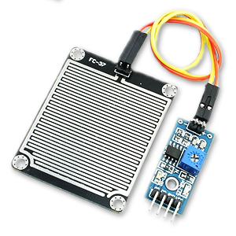
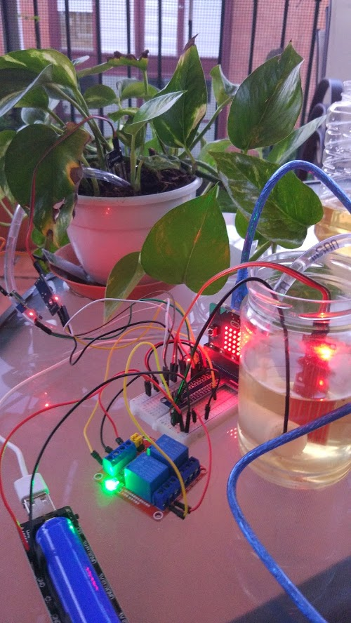

# Sistema de riego

Vamos a desarrollar con sistema de riego inteligente, que riegue las plantas cuando estén secas. Encenderemos la bomba de riego cuando el sensor de humedad que está en la macenta de nuestra planta dé una medida por debajo de un valor dado.

Usaremos la placa [micro:bit](https://www.digitspace.com/products/micro-bit/official-boards-1/microbit-go-nrf51822-development-board-python-starter?5bf8797b7ae48ca3) como controlador del sistema, programando los prototipos con [bloques](https://makecode.microbit.org/) y con [micropython](https://python.microbit.org/v/2.0)

Iremos desarrollando el proyecto en diferentes fases.

[Digitspace](https://www.digitspace.com?5bf8797b7ae48ca3) ha patrocinado todos los materiales del proyecto

## V0: Controlando una bomba de agua con un relé y micro:bit

Vamos a hacer una primera prueba de control de la bomba con el relé, conectado todo a la micro:bit con la GPIO Board, todo los componentes de [micro:bit watering kit](https://www.digitspace.com/products/micro-bit/kit/microbit-kit-automatic-watering-pump-soil-humidity-detection-with-main-board?5bf8797b7ae48ca3) de [digitspace](https://www.digitspace.com?5bf8797b7ae48ca3) y activaremos el riego con los botones de la micro:bit


El montaje lo realizamos en una placa de prototipo a la que hemos conectado la GPIO Board


Usamos el módulo con 2 relés (aunque sólo usaremos 1) para encender/apagar la bomba de agua.
 


Para la alimentación usamos una [Battery box](https://www.digitspace.com/raspberry-pi-pwm-shield-18650?5bf8797b7ae48ca3) que alimenta tanto la micro:bit como el relé. 


Configuramos el módulo, conectado el jumper de manera que el estado activo encida el relé

Conectamos el pin S2 de control del relé al pin 16 de la micro:bit


Un programa muy sencillo nos permite encender apagar el relé con los botones A y B de la micro:bit


[Usando bloques](https://makecode.microbit.org/_iJDE3iHi2eDL):

Si usamos [micropython](https://github.com/javacasm/microbitLovesPlants/blob/master/code/testrele.py)

```python

"""
Control del encendido/apagado de un relé conectado al pin 16
con lo botones
Se muestra una imagen cuando encendido y otra cuando apagado

CC by SA by @javacasm
Mayo 2020
"""
from microbit import *

imageUp = Image("00900:"
                "09990:"
                "90909:"
                "00900:"
                "00900")

imageDown = Image("00900:"
                  "00900:"
                  "90909:"
                  "09990:"
                  "00900")

while True:
    if button_a.is_pressed():
        display.show(imageUp)
        pin16.write_digital(True)
    if button_b.is_pressed():
        display.show(imageDown)
        pin16.write_digital(False)

```


En este [vídeo](https://youtu.be/tDOVUjIaInU) vemos como activamos y desactivamos el relé con los pulsadores de la micro:bit

[](https://youtu.be/tDOVUjIaInU)

## Alimentación independiente del motor V0.1

MEJORA: Si está mucho tiempo funcionando a veces se apaga, puesto que estamos alimentando todo (micro:bit, relés y motores) a través del regulador de alimentación la placa GPIO.

Para evitarlo vamos a alimentar directnmente la bomba desde la batería sin pasar por el regular de la GPIO board.


Usaremos los raíles de arriba en la imagen para todos lo que va alimentado desde la placa GPIO. Los raíles de abajo para la conexión directa a los 5V de la batería.


## Control del nivel de agua del depósito V0.5

Usamos un sensor de nivel de agua para detectar cuando nuestro depósito no tiene agua y así apagar el motor cuando no haya suficiente agua.


Hemos creado varias funciones, para controlar el riego y para visualizar el nivel de agua en el depósito: **EnciendeRiego**, **ApagaRiego**, **EstáEncendidoRiego** y **MostrarNivelAgua**


[Proyecto: Control de nivel de agua del depósito](https://makecode.microbit.org/_a8vYyX6zTWH2)


[Programa micropython](https://github.com/javacasm/microbitLovesPlants/blob/master/code/ControlNivelAguaDeposito.py)


```python
from microbit import *

imageUp = Image("00900:"
                "09990:"
                "90909:"
                "00900:"
                "00900")

imageDown = Image("00900:"
                  "00900:"
                  "90909:"
                  "09990:"
                  "00900")

imageFull = Image("99999:"
                  "99999:"
                  "99999:"
                  "99999:"
                  "99999")

imageHalf = Image("90009:"
                  "90009:"
                  "99999:"
                  "99999:"
                  "99999")

imageEmpty = Image("90009:"
                   "90009:"
                   "90009:"
                   "90009:"
                   "99999")

alarmaNivelAgua = 400

def EnciendeRiego():
    if nivelDeposito > alarmaNivelAgua:
        display.show(imageUp)
        pin16.write_digital(True) 

def ApagaRiego():
    display.show(imageDown)
    pin16.write_digital(False) 

def MostrarNivelAgua():
    if nivelDeposito < alarmaNivelAgua:
        display.show(imageEmpty)
    elif nivelDeposito < 1.5 * alarmaNivelAgua:
        display.show(imageHalf)
    else:
        display.show(imageFull)


while True:
    nivelDeposito = pin2.read_analog()
    MostrarNivelAgua()
    if button_a.is_pressed():
        EnciendeRiego()
    if button_b.is_pressed():
        ApagaRiego()

```

[Vídeo del sistema en funcionamiento](https://photos.app.goo.gl/g6w9jHdvzEWb46SQ6)

## Encendido y apagado automático V1.0

Ahora vamos a utilizar un sensor de humedad de suelo para activar el riego cuando la tierra tenga una humedad por debajo de un cierto umbral. 


El sensor de humedad de suelo da un valor de 1023 en el aire y un valor de 500 cuando el suelo está humedo. Por eso usaremos el valor **1023 - ValorSensorHumedad** para trabajar con  un valor proporcional a la humedad.

Para detener el riego colocaremos un sensor de lluvia debajo de nuestra maceta: cuando salga agua de ella consideraremos que ya se ha regado suficiente y detendremos el riego



El sensor de lluvia da un valor de 1023 en el aire y baja de 800 cuando lo mojamos



### Montaje


Relé riego: P16
Sensor humedad: P0
Sensor Agua: P1
Sensor nivel agua: P2

Alimentación: batería 18650 con adaptador a USB y salida 5V

### Programación

Cuando se detecta que la humedad del suelo es más baja del umbral establecido de enciende el riego hasta que se detecta que el agua sale de la maceta, momento en el que cortamos el riego.

Hemos creado procedimientos para realizar las distintas tareas:

* **EnciendeRiego:** comprueba que hay suficiente nivel de agua en el depósito y si es así enciende el relé de la bomba.
* **ApagaRiego:** apaga el relé que controla la bomba.
* **MostrarNivelAgua:** muestra en los leds el nivel del depósito.
* **EstaEncendidoRiego:** Devuelve el valor del pin16 que controla el relé de la bomba.
* **MedirSensores:** Lee los 3 sensores: humedad del suelo, nivel del depósito y si sale agua de la maceta y los guarda en las variables. Envía los valores por el puerto serie para verlos en el PC.
* **RevisarHumedadSuelo:** Compara el valor de humedad actual con el valor establecido y activa o no el sistema de riego.
* **Al iniciar:** establece los valores de los valores umbral.


[Proyecto de bloques](https://makecode.microbit.org/_cYceVT8Tb9bV)


[Vídeo del sistema en funcionamiento](https://photos.app.goo.gl/iRdfumym3o88ttLK6)

[Código micropython](https://github.com/javacasm/microbitLovesPlants/blob/master/code/ControlEncendidoApagadoAutomaticoRiego.py)

```python
"""
Encendemos/apagamos el riego (bomba controlada por un relé) automáticamente
según el valor de un sensor de humedad de suelo:
* Por debajo de un valor de humedad se enciende el motor
* Por encima se apaga
* Se usa un sensor de lluvia para detectar si la planta ya está expulsando
    agua por abajo
Controlamos el nivel de agua de un depósito con sensor de nivel de agua
Si el nivel es bajo el motor se apaga automáticamente

CC by SA by @javacasm
Junio 2020

"""
from microbit import *

imageUp = Image("00900:"
                "09990:"
                "90909:"
                "00900:"
                "00900")

imageDown = Image("00900:"
                  "00900:"
                  "90909:"
                  "09990:"
                  "00900")

imageFull = Image("99999:"
                  "99999:"
                  "99999:"
                  "99999:"
                  "99999")

imageHalf = Image("90009:"
                  "90009:"
                  "99999:"
                  "99999:"
                  "99999")

imageEmpty = Image("90009:"
                   "90009:"
                   "90009:"
                   "90009:"
                   "99999")

# Valores umbral para activaciones
alarmaNivelAgua = 400
humedadParaRiego = 500
sensorLluviaMojado = 800

humedadSuelo = 0
valorSensorLluvia = 0
nivelDeposito = 0


def EnciendeRiego():
    if nivelDeposito > alarmaNivelAgua:
        if not EstaEncendidoRiego():
            display.show(imageUp)
            pin16.write_digital(True)
            uart.write('############# Enciende Riego')        

def ApagaRiego():
    if EstaEncendidoRiego():
        display.show(imageDown)
        pin16.write_digital(False)
        uart.write('############# Apaga Riego')

def EstaEncendidoRiego():
    return pin16.read_digital()

def MostrarNivelAgua():
    global nivelDeposito, valorSensorLluvia, humedadSuelo
    if nivelDeposito < alarmaNivelAgua:
        if EstaEncendidoRiego() :
            ApagaRiego()
        display.show(imageEmpty)
        uart.write('_____________{}<{}'.format(nivelDeposito,alarmaNivelAgua))
    elif nivelDeposito < 1.5 * alarmaNivelAgua:
        display.show(imageHalf)
        uart.write('------------')
    else:
        display.show(imageFull)
        uart.write('#############')

def MedirSensores():
    global nivelDeposito, valorSensorLluvia, humedadSuelo
    nivelDeposito = pin2.read_analog()
    uart.write('NivelDeposito=' + str(nivelDeposito) + '  ')
    valorSensorLluvia = pin1.read_analog()
    uart.write('valorSensorLluvia=' + str(valorSensorLluvia) + '  ')
    # El sensor de humedad es inversamente proporcional a la humedad
    humedadSuelo = 1023 - pin0.read_analog()
    uart.write('humedadSuelo=' + str(humedadSuelo) + '\n')


def RevisarHumedadSuelo():
    global nivelDeposito, valorSensorLluvia, humedadSuelo, humedadParaRiego, sensorLluviaMojado
    if humedadSuelo < humedadParaRiego:
        # Mantenemos encendido el riego mientras se cumplan estas condiciones
        while humedadSuelo < humedadParaRiego and valorSensorLluvia > sensorLluviaMojado:
            EnciendeRiego()
            MedirSensores()
        ApagaRiego()

def miMain():
    # uart.init() # Viene inicializada por defecto

    while True:
        MedirSensores()
        MostrarNivelAgua()
        RevisarHumedadSuelo()
        if button_a.is_pressed():
            EnciendeRiego()
        if button_b.is_pressed():
            ApagaRiego()


```


## Deterioro sensores

El uso continuado de los sensores introducidos en agua da lugar a un rápido deterioro de los mismos debido a que al tener una diferencia de potencial entre ellos se produce la electrolisis, produciéndose corrosión en el lado positivo.

En las imágenes se puede apreciar:


Para evitarlo podríamos hacer que los sensores estuvieran encendidos sólo el tiempo que necesitamos medir. De esta manera su duración sería mayor.


## Pinout micro:bit


## Futuras versiones:

* Conexión vía radio con una centralita dentro de la casa que muestra el estado del sistema, avisando de que falta agua al depósito y del estado de humedad
* Añadir sensores de humedad, temperatura y radiación UVA