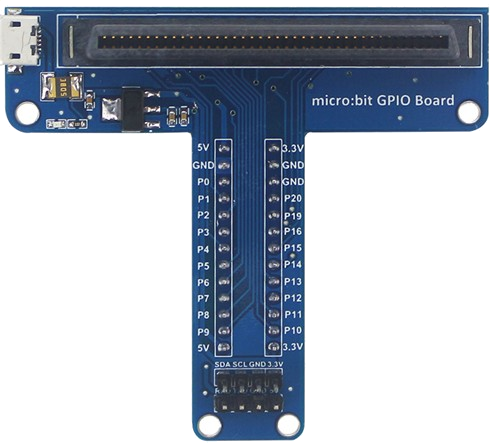

# Sistema de riego

Vamos a desarrollar con sistema de riego inteligente, que riegue las plantas cuando estén secas. Encenderemos la bomba de riego cuando el sensor de humedad que está en la macenta de nuestra planta dé una medida por debajo de un valor dado.

Usaremos la placa [micro:bit](https://www.digitspace.com/products/micro-bit/official-boards-1/microbit-go-nrf51822-development-board-python-starter?5bf8797b7ae48ca3) como controlador del sistema, programando los prototipos con [bloques](https://makecode.microbit.org/) y con [micropython](https://python.microbit.org/v/2.0)

Iremos desarrollando el proyecto en diferentes fases.

[Digitspace](https://www.digitspace.com?5bf8797b7ae48ca3) ha patrocinado todos los materiales del proyecto

## V0: Controlando una bomba de agua con un relé y micro:bit

Vamos a hacer una primera prueba de control de la bomba con el relé, conectado todo a la micro:bit con la GPIO Board, todo los componentes de [micro:bit watering kit](https://www.digitspace.com/products/micro-bit/kit/microbit-kit-automatic-watering-pump-soil-humidity-detection-with-main-board?5bf8797b7ae48ca3) de [digitspace](https://www.digitspace.com?5bf8797b7ae48ca3) y activaremos el riego con los botones de la micro:bit


El montaje lo realizamos en una placa de prototipo a la que hemos conectado la GPIO Board



Usamos el módulo con 2 relés (aunque sólo usaremos 1) para encender/apagar la bomba de agua.
 


Para la alimentación usamos una [Battery box](https://www.digitspace.com/raspberry-pi-pwm-shield-18650?5bf8797b7ae48ca3) que alimenta tanto la micro:bit como el relé. 


Configuramos el módulo, conectado el jumper de manera que el estado activo encida el relé

Conectamos el pin S2 de control del relé al pin 16 de la micro:bit


Un programa muy sencillo nos permite encender apagar el relé con los botones A y B de la micro:bit


[Usando bloques](https://makecode.microbit.org/_iJDE3iHi2eDL):

Si usamos micropython

```python

from microbit import *

imageUp = Image("00900:"
             "09990:"
             "90909:"
             "00900:"
             "00900")

imageDown = Image("00900:"
             "00900:"
             "90909:"
             "09990:"
             "00900")

p16 = Pin(16, Pin.OUT)

while True:
    if button_a.is_pressed():
        display.show(imageUp)
        pin16.write_digital(True) 
    if button_b.is_pressed():
        display.show(imageDown)
        pin16.write_digital(False) 

```


En este [vídeo](https://youtu.be/tDOVUjIaInU) vemos como activamos y desactivamos el relé con los pulsadores de la micro:bit

[](https://youtu.be/tDOVUjIaInU)

MEJORA: Si está mucho tiempo funcionando a veces se apaga, puesto que estamos alimentando todo (micro:bit, relés y motores) a través del regulador de alimentación la placa GPIO.

Para evitarlo vamos a alimentar directnmente la bomba desde la batería sin pasar por el regular de la GPIO board.


Usaremos los raíles de arriba en la imagen para todos lo que va alimentado desde la placa GPIO. Los raíles de abajo para la conexión directa a los 5V de la batería.


## Control del nivel de agua del depósito

Usamos un sensor de nivel de agua para detectar cuando nuestro depósito no tiene agua y así apagar el motor cuando no haya suficiente agua.


Hemos creado varias funciones, para controlar el riego y para visualizar el nivel de agua en el depósito: **EnciendeRiego**, **ApagaRiego**, **EstáEncendidoRiego** y **MostrarNivelAgua**

TODO: vídeo explicando el programa
TODO: programa micropython


[Proyecto: Control de nivel de agua del depósito](https://makecode.microbit.org/_a8vYyX6zTWH2)


```python

from microbit import *

imageUp = Image("00900:"
             "09990:"
             "90909:"
             "00900:"
             "00900")

imageDown = Image("00900:"
             "00900:"
             "90909:"
             "09990:"
             "00900")

imageFull = Image("99999:"
             "99999:"
             "99999:"
             "99999:"
             "99999")

imageHalf = Image("90009:"
             "90009:"
             "99999:"
             "99999:"
             "99999")

imageEmpty = Image("90009:"
             "90009:"
             "90009:"
             "90009:"
             "99999")

alarmaNivelAgua =  400

def EnciendeRiego():
    if nivelDeposito > alarmaNivelAgua:
        display.show(imageUp)
        pin16.write_digital(True) 

def ApagaRiego():
    display.show(imageDown)
    pin16.write_digital(False) 

def MostrarNivelAgua():
    if nivelDeposito < alarmaNivelAgua:
        display.show(imageEmpty)
    elif nivelDeposito < 1.5 * alarmaNivelAgua:
        display.show(imageHalf)
    else:
        display.show(imageFull)

p16 = Pin(16, Pin.OUT)

while True:
    nivelDeposito = 
    ostrarNivelAgua()
    if button_a.is_pressed():
        EnciendeRiego()
    if button_b.is_pressed():
        ApagaRiego()
    

```

[Vídeo del sistema en funcionamiento](https://photos.app.goo.gl/g6w9jHdvzEWb46SQ6)

## Pinout

Relé riego: P16
Sensor humedad: P0
Sensor Agua: P1
Sensor nivel agua: P2

