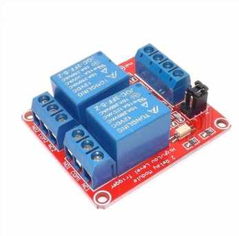
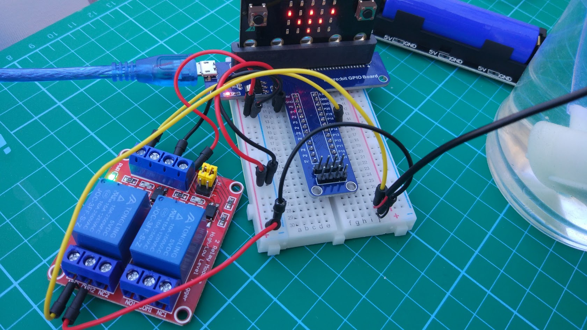
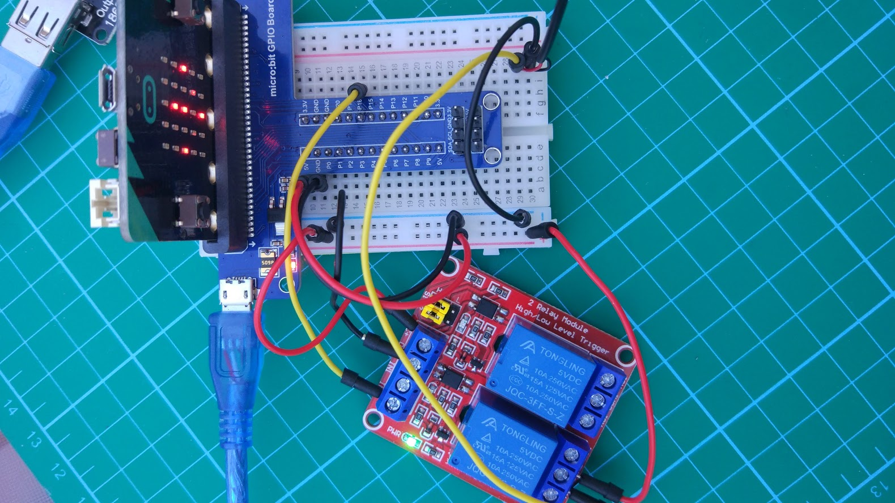
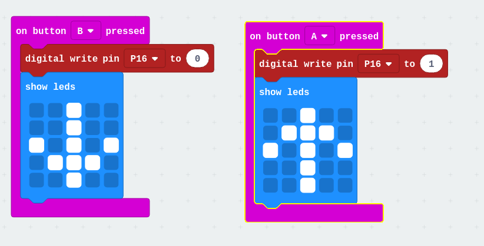

## Test de los relés

Vamos a hacer una primera prueba de control de la bomba con el relé, conectado todo a la micro:bit con la GPIO Board, todo los componentes de [micro:bit watering kit](https://www.digitspace.com/products/micro-bit/kit/microbit-kit-automatic-watering-pump-soil-humidity-detection-with-main-board?5bf8797b7ae48ca3) de [digitspace](https://www.digitspace.com?5bf8797b7ae48ca3)

TODO: fotos de los componentes por separado

Usamos el módulo con 2 relés (aunque sólo usaremos 1)
 
para encender/apagar la bomba de agua.

Configuramos el módulo, conectado el jumper de manera que el estado activo encida el relé

Conectamos el pin S2 de control del relé al pin 16 de la micro:bit

Un programa muy sencillo nos permite encender apagar el relé con los botones A y B de la micro:bit

Usando bloques:

Para la alimentación usamos una [Battery box](https://www.digitspace.com/raspberry-pi-pwm-shield-18650?5bf8797b7ae48ca3) que alimenta tanto la micro:bit como el relé. 

MEJORA: Si está mucho tiempo funcionando a veces se apaga, en 
v2 vamos a alimentar directnmente la bomba desde la batería sin pasar por el regular de la GPIO board.

